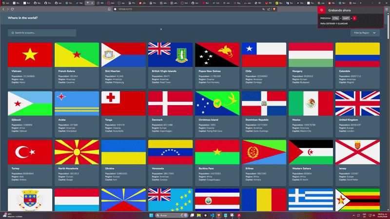

# Frontend Mentor - REST Countries API with color theme switcher solution

This is a solution to the [REST Countries API with color theme switcher challenge on Frontend Mentor](https://www.frontendmentor.io/challenges/rest-countries-api-with-color-theme-switcher-5cacc469fec04111f7b848ca). Frontend Mentor challenges help you improve your coding skills by building realistic projects.

<a href="https://quirozdev.github.io/country-displayer/" target="_blank">Live Site Demo</a>

## Table of contents

- [Overview](#overview)
  - [The challenge](#the-challenge)
  - [Links](#links)
- [My process](#my-process)
  - [Built with](#built-with)
- [Author](#author)

## Overview

### The challenge

Users should be able to:

- See all countries from the API on the homepage
- Search for a country using an `input` field
- Filter countries by region
- Click on a country to see more detailed information on a separate page
- Click through to the border countries on the detail page
- Toggle the color scheme between light and dark mode _(optional)_

### Links

- <a href="https://github.com/Quirozdev/country-displayer" target="_blank">Solution URL</a>
- <a href="https://quirozdev.github.io/country-displayer/" target="_blank">Live Site URL</a>

### Built with

- React and Typescript
- TailwindCSS
- Responsive design
- CSS Grid
- Zustand

## Author

- GitHub - <a href="https://github.com/Quirozdev" target="_blank">Quirozdev</a>
